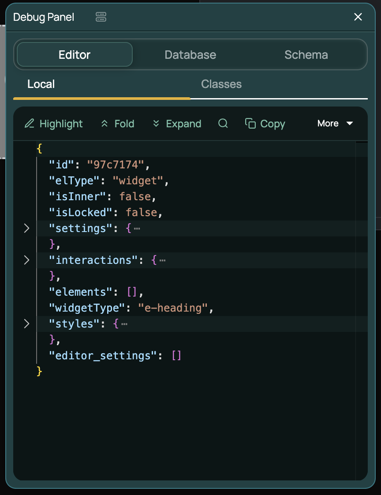
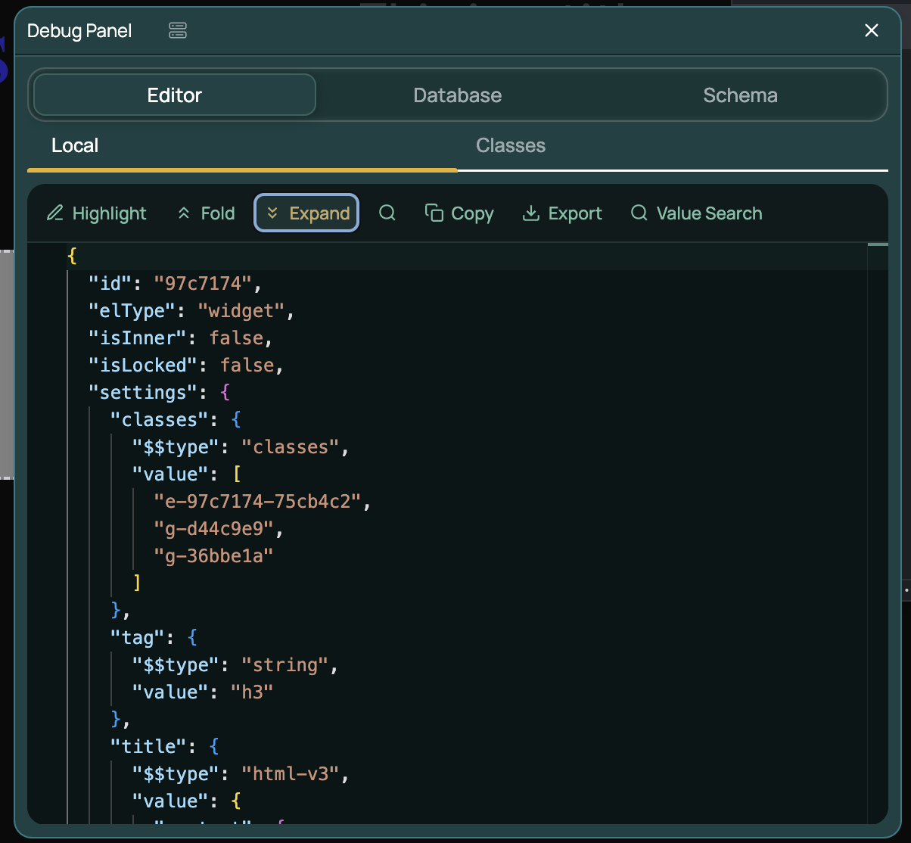
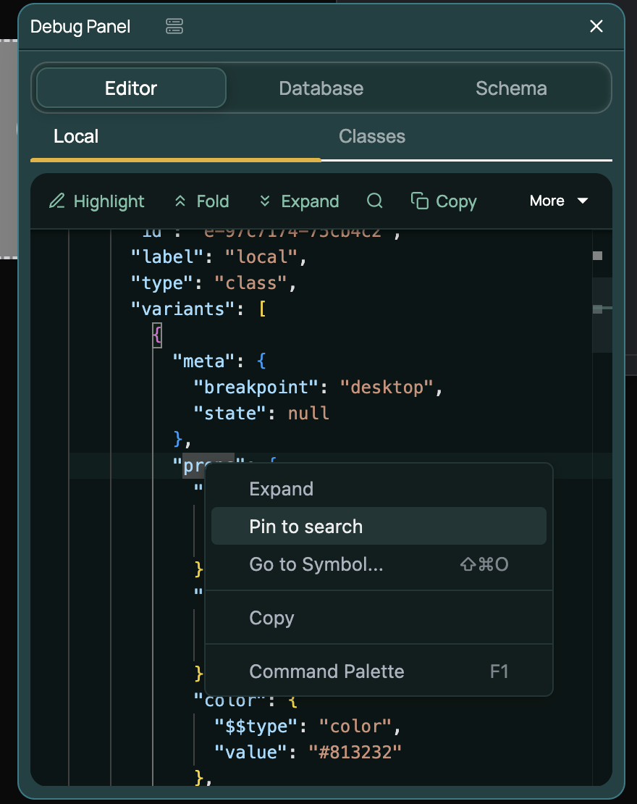
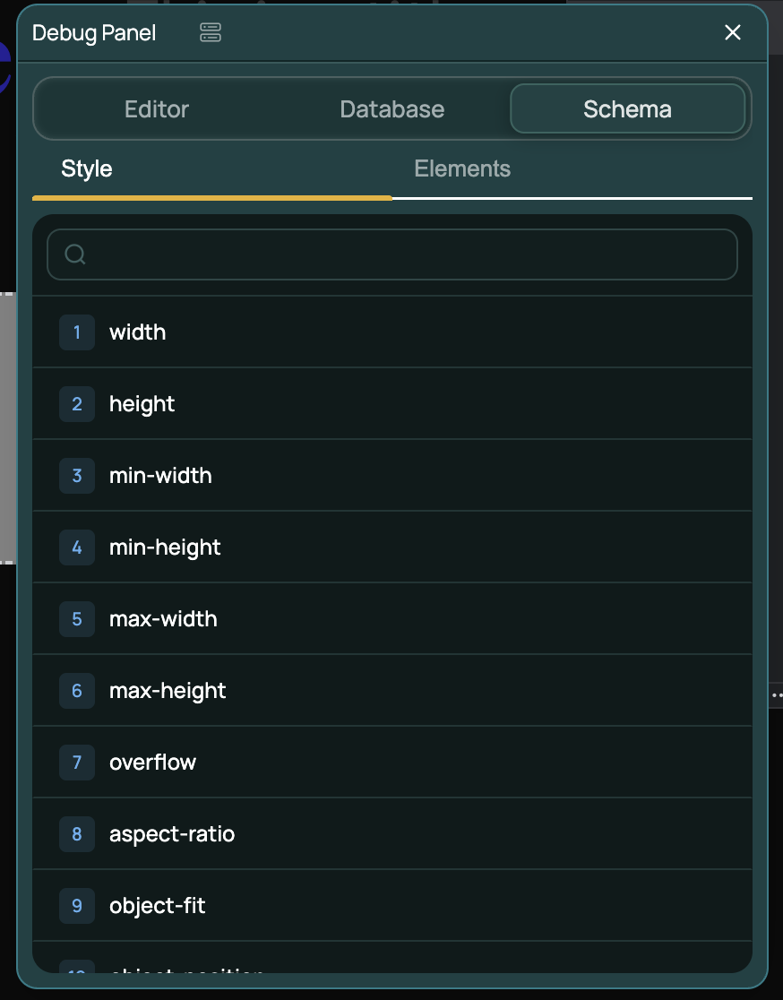
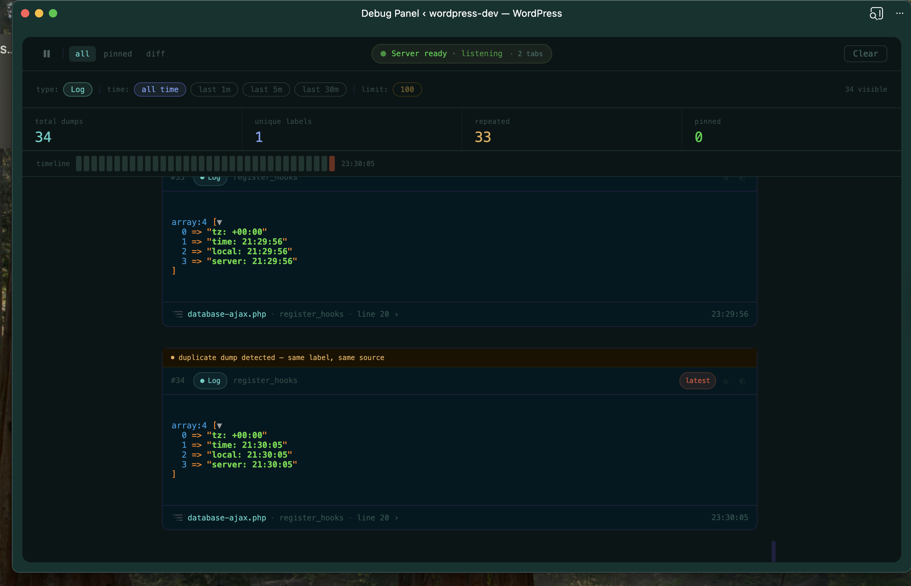

# Debug Panel

A WordPress plugin for Elementor developers. Inspect live element state, database records, and style schemas directly inside the editor — plus a companion real-time dump panel for server-side PHP debugging.

---

## Contents

- [Dev Panel — In-editor Inspector](#dev-panel--in-editor-inspector)
  - [Editor tab](#editor-tab)
  - [Database tab](#database-tab)
  - [Schema tab](#schema-tab)
- [Debug Panel — Real-time PHP Dumps](#debug-panel--real-time-php-dumps)
  - [Sending data with dp()](#sending-data-with-dp)
  - [Reading the panel](#reading-the-panel)
  - [Keyboard shortcuts](#keyboard-shortcuts)
- [Requirements](#requirements)
- [Installation](#installation)
- [Changelog](#changelog)

---

## Dev Panel — In-editor Inspector

A panel inside the Elementor editor for browsing element data, database records, and schema definitions in real time. Open any page in the Elementor editor and click the **Debug Panel** icon in the bottom-right corner. Select any element on the canvas to start inspecting it.

### Editor tab

Shows the live JSON state of the currently selected element — updates instantly as you make changes on the canvas.

- **Local** — the element's own model data: id, type, settings, styles, and interactions
- **Classes** — global classes attached to the element





The toolbar gives you full control over the JSON view:

| Action | Description |
|---|---|
| **Highlight** | When active, any property that changes as you interact with the Elementor editor is visually highlighted — instantly see which part of the JSON your edits affect |
| **Fold / Expand** | Collapse or open all nodes at once |
| **Search** (`⌘F`) | Find keys or values inside the tree |
| **Copy** | Copy the full JSON to clipboard |
| **Export** | Download as a `.json` file |
| **Value Search** | Search by value across the entire tree |

Right-clicking any node in the JSON tree opens a context menu with:

- **Expand** — expand that node and all its children
- **Pin to search** — locks that node's path into the search so it stays in view as the data updates around it



### Database tab

Shows what is actually saved in WordPress for the current page and kit — the source of truth vs. what the editor holds in memory.

- **Post** — the raw `_elementor_data` for the current page (the saved document tree)
- **Variables** — kit-level CSS variables
- **Classes** — global classes defined at the kit level

### Schema tab

A searchable reference for all registered Elementor properties and element types — useful for understanding what controls exist and what values they accept.

- **Style** — every registered style property in order (width, height, padding, typography, …)
- **Elements** — all registered element types and their configuration



---

## Debug Panel — Real-time PHP Dumps

A companion browser window that receives `dp()` calls from your PHP code instantly. No page reloads, no `var_dump` cluttering the front end — structured output with full call stacks.




### Sending data with `dp()`

Call `dp()` anywhere in your PHP:

```php
$posts = get_posts();
dp( $posts );
```

Pass multiple values — each becomes its own log entry:

```php
dp( $query, $results, $meta );
```

Add a label so entries are easy to identify:

```php
dp( with_label( 'Query args', $args ) );
dp( with_label( 'Post meta', get_post_meta( $post_id ) ) );
```

Force JSON formatting:

```php
dp( as_json( $complex_array ) );
```

### Reading the panel

Each log entry shows the label, index, full variable dump, and a footer with the source file, caller function, and line number.

**Call Stack** — click the footer of any entry to open the backtrace popover. Select any frame to inspect it. Click **Open in editor** to jump to that exact line in PhpStorm, Cursor, or VS Code — your editor preference is saved per browser.

**Stats bar** — total dumps, unique labels, repeated calls, and pinned count at a glance.

**Timeline** — a bar across the top that maps every dump to a point in time. Click any blip to jump to that entry. Timestamps are shown in your local timezone.

**View modes:**

| Mode | Shows |
|---|---|
| **all** | Every dump received |
| **pinned** | Pinned entries only |
| **diff** | Only entries where the same `dp()` call fired more than once — useful for catching hooks running on every request |

**Filters** — toggle individual labels on/off, filter by time range (last 1m / 5m / 30m), or cap the log limit.

### Keyboard shortcuts

| Key | Action |
|---|---|
| `P` | Pause / Resume incoming dumps |
| `C` | Clear all logs |
| `↑` / `↓` | Navigate between entries |

---

## Requirements

- WordPress 6.2+
- PHP 7.4+
- Elementor (any recent version)

## Installation

1. Copy the plugin folder to `wp-content/plugins/debug-panel/`
2. Activate **Debug Panel** in wp-admin → Plugins
3. Open a page in the Elementor editor — the panel icon appears in the bottom-right corner

---
